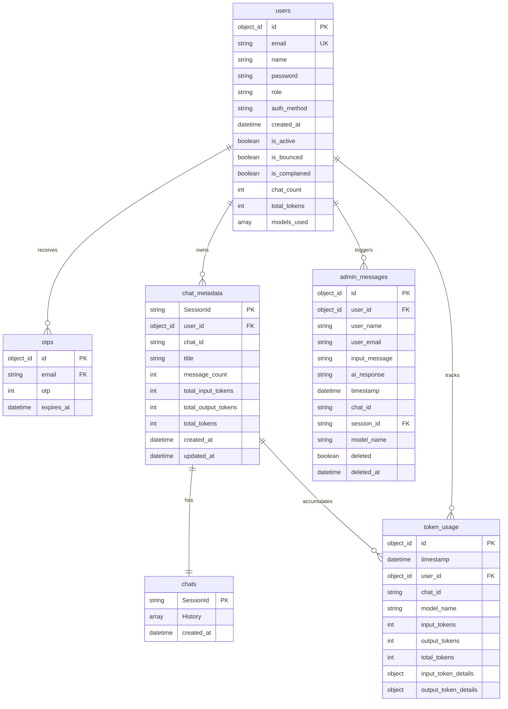

# Database Entity-Relationship Diagram

This document presents the Entity-Relationship Diagram (ERD) for the NexLab application. The backend uses **MongoDB** as its primary data store, using six key collections for user authentication, chat session management, activity tracking, and token usage telemetry.

## Schema Summary

The database architecture is designed around the central **`users`** entity:
1.  **Authentication & Security**: The **`users`** collection stores credentials, roles, status flags, and usage aggregates. **`otps`** manages temporal passcode verification for registration and password resets.
2.  **Conversations & History**: Chat sessions are split into **`chat_metadata`** (for fast indexing, listing, pagination, and session statistics) and **`chats`** (which contains the raw, serialized LangChain history). They share a one-to-one relationship mapped by `SessionId` (which is constructed as `user_id_chat_id`).
3.  **Auditing & Telemetry**: **`admin_messages`** acts as a denormalized activity feed for admin monitoring. **`token_usage`** is a MongoDB **Time-Series collection** structured to track token consumption details across different models and chats for fine-grained logging and analytics.

---

## Entity-Relationship Diagram

---

## Data Dictionary

| Collection / Entity | Source Schema / Collection Name | Description |
| :--- | :--- | :--- |
| **`users`** | `settings.USER_COLLECTION_NAME` (`users`) | Stores registered user accounts, roles (`user`, `admin`), active status, email delivery health flags (`is_bounced`, `is_complained`), and cache/aggregates for chat count, total token usage, and used models list. |
| **`otps`** | `settings.OTP_COLLECTION_NAME` (`otps`) | Holds verification passcodes used during registration and password reset. Features a TTL index on `expires_at` that automatically deletes expired entries after 5 minutes. |
| **`chat_metadata`**| `settings.CHAT_METADATA_COLLECTION_NAME` (`chat_metadata`) | Stores metadata summary per chat session (title, count, model and token aggregation) for fast query listing and pagination. |
| **`chats`** | `settings.CHAT_COLLECTION_NAME` (`chats`) | Stores the full conversation history. The `History` attribute is a list of serialized messages (human messages and AI response documents including model information and metadata). |
| **`admin_messages`**| `settings.ADMIN_MESSAGES_COLLECTION_NAME` (`admin_messages`) | Denormalized activity feed. Captures input messages and assistant responses for admin auditing. Supports logical soft delete. |
| **`token_usage`** | `settings.TOKEN_USAGE_COLLECTION_NAME` (`token_usage`) | Time-series collection tracking granular input and output token breakdowns (e.g., text, audio, reasoning, cache hits) for each chat request. |
